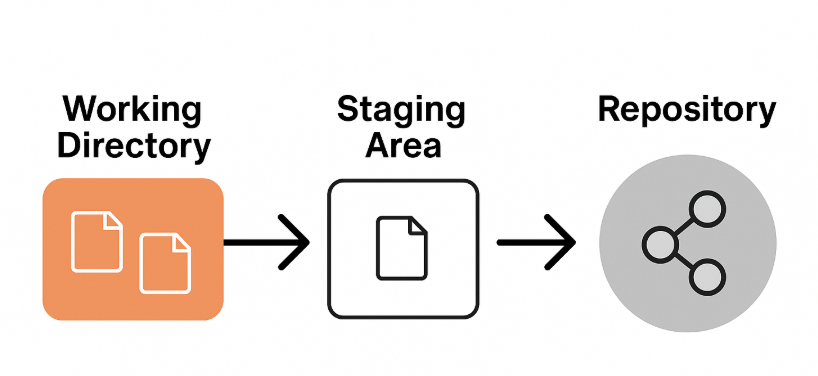

# 깃 개념

## 스냅샵
- 스냅샷은 "사진 찍듯이 현재 상태를 보존"하는 걸 말합니다.
예를 들어, 운영체제나 가상머신에서 스냅샷을 찍으면 그 시점으로 언제든 되돌릴 수 있는 복사본이 생기는 거예요.

### 3가지 영역
* 작업 트리(Working Tree)
: 프로젝트 내부에 실제로 변경된 파일이 있는 영역
* 스테이징 영역(Staging Area)
: 파일을 저장소에 저장하기 전 가상의 영역으로 파일을 보관하는 영역(무대, Stage)변경된 파일 중 저장할 파일을 보관하는 영역
* 저장소(Local Repository)
:변경된 파일이 저장되는 영역
저장소에 저장된 파일은 변경된 사항을 변경할 수 없다

# 깃 명령어

## 변경된 파일을 스테이징 영역으로 이동하는 명령어 
- `git add 파일명`
- `git add .` : 전체 파일 이동

## 스테이징 영역에 있는 파일을 기록(커밋)하는 명령어
- `git commit` 
- `git commit -m "커밋 메세지"` 

## 현재 파일 상태를 출력하는 명령어 
- `git status`

### 이미지랑 함께 일지를 마크다운 형식으로 작성
### 업로드 프로세스(CLI)
1. 파일수정 
2. 터미널 입력 -> 값: `git add .` 
3. 터미널 입력 -> 값: `git status`
4. 수정중인 파일 확인 -> 맞으면 다음
5. 터미널 입력 -> 값: `git commit -m "message"
6. 터미널 입력 -> 값: `git status`
7. 상태 확인하면 끝 

# gitbub
1. 원격 저장소 생성
2. 지역 저장소 - 원격 저장소 연결
3. 지역 저장소 -> 원격 저장소 push
4. 원격 저장소 파일 생성
5. 지역 저장소 <- 원격 저장소 pull

## git psuh origin main, origin은 무엇인가?
- `git push <원격저장소명> <브랜치명>` /  `git pull <원격저장소명> <브랜치명>` 
- `git remote add <원격저장소명> <브랜치명>`
- `origin`이라는 원격저장소명은 관습적인 이름.

## 원격 저장소란 무엇인가?
- **원격 저장소**는 인터넷이나 네트워크 서버에 위치한 Git 저장소입니다.  
- 여러 사람이 협업할 때, 코드를 공유하고 협력할 수 있는 중심지 역할을 합니다.  
- 대표적인 서비스: GitHub, GitLab, Bitbucket

## 지역 저장소와 원격 저장소의 구분
- **지역 저장소(Local)**  
  - 내 컴퓨터 안에 있는 Git 저장소  
  - 작업 트리(Working Directory), 스테이징 영역(Staging Area), Git 데이터베이스(.git) 포함  
  - 인터넷 연결 없이도 커밋, 브랜치 작업 가능  

- **원격 저장소(Remote)**  
  - 네트워크 상의 중앙 저장소  
  - 여러 사람이 접근하여 Push(업로드), Pull(다운로드)로 코드 공유  
  - 협업의 기준이 되는 저장소  

## 지역 저장소와 원격 저장소의 동기화란 무엇인가?

- 지역 저장소와 원격 저장소의 내용을 **동일하게 맞추는 작업**을 의미합니다.
- 주요 명령어:
  - `git push` → 지역 저장소의 커밋을 원격 저장소에 업로드  
  - `git pull` → 원격 저장소의 변경 사항을 지역 저장소로 가져오기  
  - `git fetch` → 원격 저장소의 변경 사항을 확인(병합은 하지 않음)

👉 즉, "동기화"란 **내 컴퓨터와 원격 서버의 코드 상태를 일치시키는 것**입니다.

## 원격 저장 시 주의할 점

1. **push 전 pull 먼저**: 다른 사람의 작업을 덮어쓰지 않도록 항상 `git pull` 또는 `git fetch`로 원격 저장소의 최신 변경 사항을 먼저 확인하세요.
2. **정확한 원격 저장소와 브랜치 사용**: `git push origin main`과 같이, 내가 작업한 내용을 올릴 정확한 원격 저장소(`origin`)와 브랜치(`main`)를 명시해야 합니다.
3. **`origin`은 관례적인 이름**: `origin`은 원격 저장소를 가리키는 기본 이름일 뿐, 다른 이름으로 설정할 수도 있다는 점을 기억하세요.
4. **상태 확인 습관화**: `git status` 명령어를 습관적으로 사용하여 현재 파일들의 상태를 확인하고, 실수로 원하지 않는 파일을 올리는 것을 방지하세요.
5. **명확한 커밋 메시지**: 협업하는 동료가 변경 사항을 쉽게 이해할 수 있도록 커밋 메시지를 명확하고 상세하게 작성하는 것이 좋습니다.
6. **`fetch`로 안전하게 확인**: `git fetch`를 사용하면 원격 저장소의 변경 내용을 가져오기만 하고 자동으로 병합하지 않으므로, 내 작업에 영향을 주지 않고 안전하게 변경 사항을 확인할 수 있습니다.
7. **로컬과 원격의 차이 이해**: 내 컴퓨터의 지역 저장소와 팀원들과 공유하는 원격 저장소는 별개라는 점을 명확히 이해하고 동기화해야 합니다.
8. **불필요한 파일 제외**: `.gitignore` 파일을 사용하여 로그 파일, 빌드 결과물 등 원격 저장소에 올릴 필요가 없는 파일들을 미리 제외하세요.
9. **충돌 해결 준비**: 여러 명이 같은 파일을 동시에 수정하면 충돌(Conflict)이 발생할 수 있습니다. 충돌 해결 방법을 미리 숙지해두는 것이 좋습니다.
10. **주기적인 push**: 너무 많은 작업을 한 번에 push하기보다, 의미 있는 단위로 작업을 나누어 주기적으로 push하여 다른 팀원들과 코드를 자주 공유하는 것이 안전합니다.
