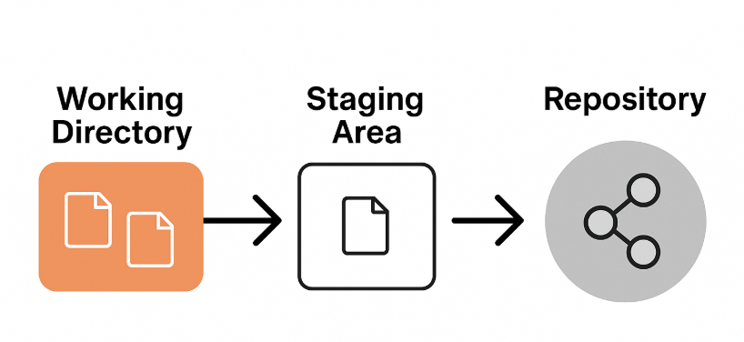

# 깃 개념

## 스냅샵
- 스냅샷은 "사진 찍듯이 현재 상태를 보존"하는 걸 말합니다.
예를 들어, 운영체제나 가상머신에서 스냅샷을 찍으면 그 시점으로 언제든 되돌릴 수 있는 복사본이 생기는 거예요.

### 3가지 영역
* 작업 트리(Working Tree)
: 프로젝트 내부에 실제로 변경된 파일이 있는 영역
* 스테이징 영역(Staging Area)
: 파일을 저장소에 저장하기 전 가상의 영역으로 파일을 보관하는 영역(무대, Stage)변경된 파일 중 저장할 파일을 보관하는 영역
* 저장소(Local Repository)
:변경된 파일이 저장되는 영역
저장소에 저장된 파일은 변경된 사항을 변경할 수 없다

# 깃 명령어

## 변경된 파일을 스테이징 영역으로 이동하는 명령어 
- `git add 파일명`
- `git add .` : 전체 파일 이동

## 스테이징 영역에 있는 파일을 기록(커밋)하는 명령어
- `git commit` 
- `git commit -m "커밋 메세지"` 

## 현재 파일 상태를 출력하는 명령어 
- `git status`

### 이미지랑 함께 일지를 마크다운 형식으로 작성
### 업로드 프로세스(CLI)
1. 파일수정 
2. 터미널 입력 -> 값: `git add .` 
3. 터미널 입력 -> 값: `git status`
4. 수정중인 파일 확인 -> 맞으면 다음
5. 터미널 입력 -> 값: `git commit -m "message"
6. 터미널 입력 -> 값: `git status`
7. 상태 확인하면 끝 